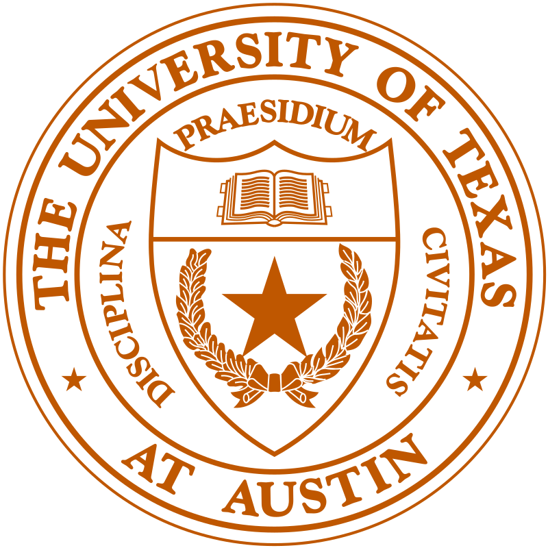

# Data Scientist

### Seeking full time employment opportunities in Data Science

#### Technical Skills: Python, SQL, GCP, Snowflake, R, Tableau

## Education

<table>
  <tr>
    <td></td>
    <td>MS Business Analytics, UT Austin, GPA: 3.86/4, May '24</td>
  </tr>
  <tr>
    <td></td>
    <td>BE Mechanical Engineering, RIT, GPA: 8.44/10, May '20</td>
  </tr>
</table>

## Work Experience

<table>
  <tr>
    <td></td>
    <td>
      <strong>Senior Data Scientist (Jan 2022 - May 2023)</strong> 
      - Spearheaded retail forecasting projects to estimate the impact of pricing on sales, which helped save $500K+ annually 
      - Conducted A/B tests to pinpoint and eliminate ineffective coupons for e-commerce clients, saving $50K annually 
      - Liaised with clients, addressing business problems and handling inquiries about models used for forecasting
    </td>
  </tr>
  <tr>
    <td></td>
    <td>
      <strong>Data Scientist (Jan 2022 - May 2023)</strong> 
      - Optimized SQL queries, cutting runtime by 60%, and developed APIs for easy client modification of sales forecasts 
      - Implemented post-Covid drift correction models, boosting accuracy and saving $1M via better inventory management 
      - Implemented a methodology for identifying lost sales, which then helped capture lost revenue worth over $500,000
    </td>
  </tr>
</table>

## Projects

<table>
  <tr>
    <td></td>
    <td><strong>Beer Recommender System</strong> 
      In this project, I implemented a sophisticated beer recommender system by scraping comments from a beer review website and incorporating user preferences like flavor profiles (e.g., dark, coffee). Leveraging lift analysis, I identified beers with similar traits, ensuring personalized recommendations. Additionally, I employed OpenAI's ChatGPT for sentiment analysis on user comments, filtering out beers with positive reviews. The result is a dynamic recommender that not only aligns with users' taste preferences but also guarantees a positive drinking experience. The key skills I utilized in this project are web scraping, data analysis, and natural language processing.</td>
  </tr>
  <tr>
    <td></td>
    <td><strong>Driver Safety Using Computer Vision</strong> 
      The project focuses on addressing the issue of distracted driving by utilizing Convolutional Neural Networks (CNNs) and Transfer Learning models. It aims to automatically detect distracted behaviors, such as texting or talking on the phone, using a dataset of 2D dashboard camera images. The motivation comes from the high incidence of distracted driving-related accidents and the potential of dashboard cameras to improve safety. The approach involves leveraging pre-trained models for feature extraction, specifically employing CNNs and Transfer Learning. The key skills I utilized in this project are convolutional neural networks, transfer learning,computer vision and classification.</td>
  </tr>
</table>

